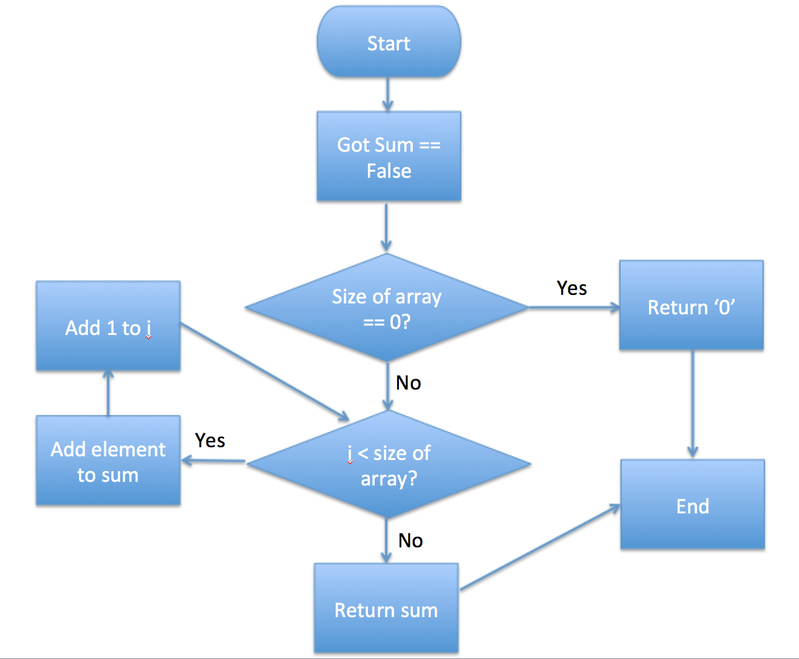

# 개발을 위한 문제해결 프로세스

## Process of Problem Solving
1. Computational Thinking
2. Flow Chart
3. Pseudo Code
4. Algorithm(Write Code)

<br>

### Computational Thinking
- What?
  - 정답이 정해지지 않은 문제에 대한 해답을 다양한 시나리오별로 경우의 수를 따져서, 하나하나씩 논리적으로 답을 찾아가는 과정

- How?
  1. 문제인지: 문제가 무엇인가?
  2. 문제분해 -> 문제 조직화: 문제를 다양한 시나리오별로 구조화하는 것: 문제를 해결하기 위해서 어떻게 해야겠다.
      1. 시나리오 1(첫번째 경우의 수)
          1. 시나리오 1-1
          2. 시나리오 1-2
      2. 시나리오 2(두번째 경우의 수)
          1. 시나리오 2-1
          2. 시나리오 2-2
  3. 패턴인지: 이 문제를 해결하기 위해서는 어떻게(시나리오) 해결하면 되겠구나.
  4. 일반화/추상화: 어떤 문제를 해결하기 위해서는 {변수}를 어떻게(어디/무엇 등) 해결한다.


- Example

```
문제: array의 모든 element의 합을 구해라.

1. 문제인지: array의 모든 element의 합을 구해야한다.

2. 문제분해: array의 각 element에 접근해서 총합을 구한다.
    1. 총합 sum = 0을 선언한다.
    2. array의 element가 없다면?
        1. sum을 리턴한다.
    3. array의 element가 존재한다면?
        1. 반복문을 이용해서 sum에 첫 element(i = 0)부터 마지막 element(array.length-1)까지 모두 더한다. 
        2. sum을 리턴한다.

3. 패턴인지: array의 모든 element의 합을 구하려면, 반복문을 이용하면 구할 수 있다.

4. 일반화/추상화: array의 모든 element의 합은 반복문을 통해 {{i번째 element}}에 접근하여 그 값을 {{sum}}에 쌓음으로써 구현한다.

```

<br>

### Flow Chart
- What?
  - Computational Thinking을 통해 작성한 시나리오를 하나의 흐름으로 이해하기 위해 작성하는 순서도
- How?
  - 문제가 생기는 점(Start)에서 문제가 해결되는 점(End)까지 각 경우의 수에 따라 Yes/No를 기본으로 순서도를 작성.

- Example




<br>

### Pseudo Code
- What?
  - 프로그램이 수행할 내용을 인간이 이해할 수 있는 언어로 작성하는 것.

<br>

- 의사코드를 작성하면 좋은점?
  - 프로그램을 설계할 때, 밑그림(스케치)의 역할을 하여, 실제 코딩하기 전 사고를 좀 더 명확하게 정립을 할 수 있다.
  - 의사코드로 소스코드 실행없이 상세 설계를 검토할 수 있어, Code Review가 더 쉬워진다.
  - 코드 수정을 좀 더 용이하게 만든다. 일부 의사코드 몇 줄을 수정하는 것은 한 페이지 전체의 코드를 수정하는 것 보다 쉽다. 코드입력, 테스트, 디버그 등의 수정 단계에서 작업하는 것 보다 의사코드 설계 단계에서 미리 오류를 수정하는 것이 훨씬 경제적이다.
  - 의사코드는 소스코드의 코멘트(주석)가 되기 때문에, 나중에 따로 코멘트를 작성하지 않아도 된다.

<br>

- 의사코드를 효과적으로 작성하는 방법
  - 프로그래밍 문법에 맞게 작성한다.
    - 조건문(if-else), 반복문(while, for) 등을 사용한다.
    - 변수(n)를 사용한다.
  - 간결하게 쓰되, 구체적으로 작성한다.
  - 의사코드에서 많이 사용되는 영어 단어를 사용한다.


<br>

- 의사코드에서 많이 쓰이는 영어 단어
  - 입력: GET, READ, OBTAIN
  - 출력: PRINT, DISPLAY, SHOW
  - 초기화: SET, INIT
  - 계산: COMPUTE, CALCULATE, DETERMINE
  - 반복: WHILE, FOR
  - 조건문: IF-THEN-ELSE, CASE
  - 마지막에 조건문이 있는 반복문: REPEAT-UNTIL
  - 요소를 추가: INCREMENT, BUMP
  - 부울: TRUE/FALSE
  - 선형적으로 증가할 때: SEQUENCE
  - 그외: REPEAT - UNTIL RETURN BEGIN / EXCEPTION / END

<br>

- Example

```
1. Get an array of integers from user ==> arr, i =0

2. Set sum of all elements of an array ==> sum = 0

3. If size of array == 0, then return 0

4. WHILE i is less than size of array,
    1. Add element(arr[i]) to sum
    2. if i == size of array, then return sum
```

<br>

### Algorithm
- What?
  - 목표를 달성하거나 결과물을 생산하기 위해 필요한 과정들
- How?
  - 미리 작성한 의사코드를 바탕으로 Write Code!


- Example

```
function simpleArraySum(ar) {
    
    var sum = 0;
    
    if(ar.length === 0) {
        return 0;
    }
    
    for(var i =0; i < ar.length; i++) {
        sum += ar[i];
    }
    
    return sum;

}
```


